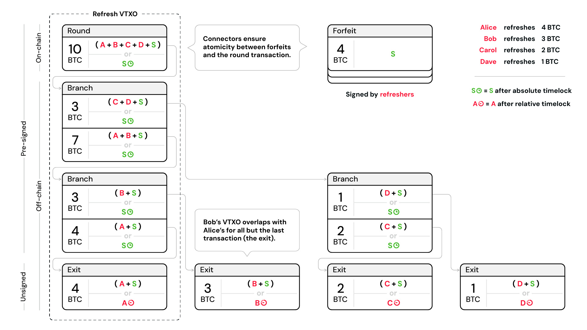

<h1>Bark: Ark on bitcoin</h1>

Fast, low-cost, self-custodial payments on bitcoin.

   
  <a href="https://docs.second.tech">Docs</a> ·
  <a href="https://gitlab.com/ark-bitcoin/bark/issues">Issues</a> ·
  <a href="https://second.tech">Website</a> ·
  <a href="https://blog.second.tech">Blog</a> ·
  <a href="https://www.youtube.com/@2ndbtc">YouTube</a>

 

Bark is an implementation of the Ark protocol on bitcoin, led by [Second](https://second.tech). The Ark protocol is a bitcoin layer 2 for making fast, low-cost, self-custodial payments at scale. Ark uses a client-server model to enable users to transact off-chain while still being able to "exit" their balances on-chain at any time.

The project consists of:

- The Ark wallet: **bark**
- The Ark server: **captaind**
- A set of libraries containing all protocol primitives

> **Warning**  
> This repository contains experimental code. Using it with real bitcoin is reckless and can result in loss of funds.
>
> - Updating bark or captaind may corrupt your wallet-we prioritize development velocity over backward compatibility.
> - Known bugs and vulnerabilities can still lead to loss of funds.

## Get started

- [**Make your first Ark transactions**](https://docs.second.tech/getting-started/): Step-by-step guide to set up a CLI wallet, get sats from [our faucet](https://signet.2nd.dev), and buy some treats from [our test store](https://signet.2nd.dev/store).
- [**Compile from source**](https://docs.second.tech/getting-started/optional/compile-from-source/)
- [**Set up an Ark server**](https://docs.second.tech/run-ark-server/): For patient folks looking to do more in-depth testing!

## What if I don't speak rust?

No rust, no problem!

**barkd** is an Ark wallet that runs as a daemon and exposes a REST API over HTTP.
It's well suited for power users and great for automation—think web shops, Telegram/Discord bots, and similar use cases.
The [barkd-clients repository](https://gitlab.com/ark-bitcoin/barkd-clients) provides clients in TypeScript and C#.

**uniffi-bindings** are the better choice if you're building a native
desktop or mobile application. The bindings are available in the
[bark-ffi repository](https://gitlab.com/ark-bitcoi/bark-ffi).
Note, that these are still experimental, but stabilizing quickly.

## Why Ark?

As bitcoin adoption grows, on-chain fees spike during busy periods, making everyday transactions impractical. While Lightning has been revolutionary for bitcoin scaling, it's beginning to show its limitations-channel management and liquidity requirements create complexity for developers and users.

Ark offers a complementary scaling solution that simplifies bitcoin self-custody:

🏃‍♂️ **Smooth onboarding**: No channels to open, no on-chain setup required-create a wallet and start transacting  
🤌 **Simplified UX**: Send and receive without managing channels, liquidity, or routing  
🌐 **Universal payments**: Send Ark, Lightning, and on-chain payments from a single off-chain balance  
🔌 **Easier integration**: Client-server architecture reduces complexity compared to P2P protocols  
💸 **Lower costs**: Instant payments at a fraction of on-chain fees  
🔒 **Self-custodial**: Users maintain full control of their funds at all times

Perfect for users who want self-custody without the hassle, and developers who want to build bitcoin apps without the complexity.

[Learn more about Ark's benefits →](https://second.tech)

## How does Ark work?

The Ark protocol enables multiple users to share control of a single bitcoin UTXO through a tree of pre-signed, off-chain transactions. This allows instant, off-chain payments while maintaining self-custody-users can always withdraw their bitcoin either cooperatively with the Ark server or unilaterally on-chain.

For a detailed technical explanation, see our [protocol documentation](https://docs.second.tech/protocol/intro).

_A transaction tree showing how Ark enables multiple users to share control of a single UTXO through pre-signed transactions._

## Minimum Supported Rust Version (MSRV)

Most of our crates do not yet specify a MSRV, but we will commit to one once we
make an official release.

The `ark-lib` crate (and by extension the `bark-bitcoin-ext` crate) have a MSRV
of v1.74.0.

## Contributing

Thinking of opening a pull request? See our [contribution guide](CONTRIBUTING.md) for dependencies, style guidelines, and code hygiene expectations.

## Questions or issues

If you run into any issues at all, let us know:

- [Community forum](https://community.second.tech)
- [Issue tracker](https://gitlab.com/ark-bitcoin/bark/issues)

## Security policy and responsible disclosure

**The Ark protocol code is experimental and must not be used in production.**

If you happen to find a vulnerability we invite you to [file a public issue](https://gitlab.com/ark-bitcoin/bark/issues/new).

## License

Released under the **CC0 1.0 Universal** license-see the [LICENSE](LICENSE) file for details.
